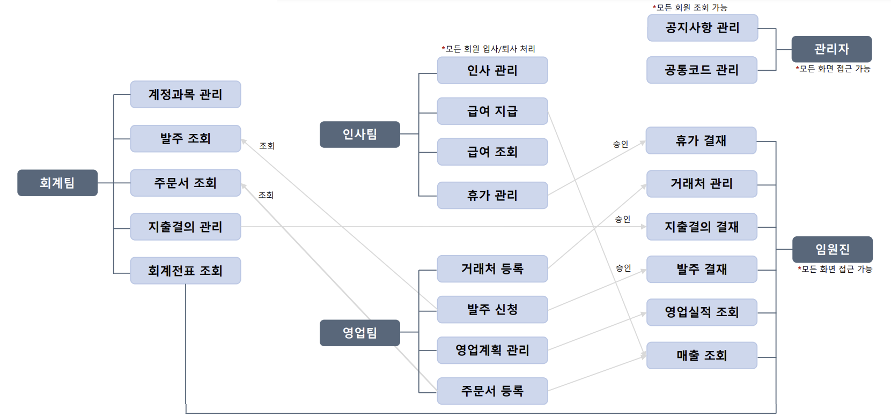
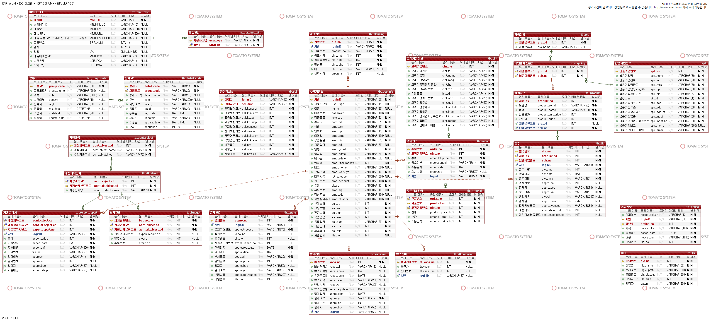
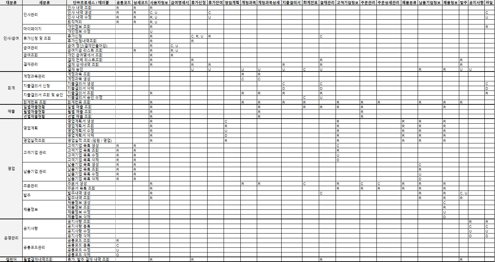

# 🗂️ ERP Project 

> 제작 기간 : 2023-05-31 ~ 2023-07-12
>
> 팀 구성 : 2팀 / 강문주, 박동근, 이선희, [이수경](https://github.com/code-sum), 이은지, 조하나
>
> ---
>
> < Contents >
>
> [I. 프로젝트 개요](#I.-프로젝트-개요)
>
> [II. 프로젝트 기획](#II.-프로젝트-기획)
>
> [III. 프로젝트 설계](#III.-프로젝트-설계)
>
> [IV. 기능 구현](#IV.-기능-구현)
>
> [V. 성과](#V.-성과)
>
> ---

# I. 프로젝트 개요

#### 1. 선정 이유

- 비즈니스 프로세스를 개선하고 효율성을 향상시킬 수 있는 **업무 자동화** 솔루션을 개발한다.
- **인사, 회계, 영업, 매출 데이터**를 처리하여 실무 현장에서 활용할 수 있는 개발 역량을 강화한다.

#### 2. 기대 효과

- 비즈니스의 불필요한 절차를 최소화하고 업무 중복을 제거하여, 작업의 일관성을 유지하고 생산성을 향상시킨다.
- 파편적으로 처리하던 서류 작업을 자동화하여, 업무 처리 시간을 단축하고 인력과 자원의 효율성을 극대화한다.
- 전체 데이터를 하나의 중앙 데이터베이스에 통합하여, 실시간 공유가 가능해지고 데이터의 일관성과 정확성을 높인다.

#### 3. 역할 분담

- 강문주 : 결재관리 / 공지사항 / 공통코드관리 / 월별결재관리
- 박동근 : 제품정보 / 일별매출현황 / 월별매출현황 / 연별매출현황
- 이선희 : 발주내역조회 / 휴가신청 및 연차조회 / 휴가신청내역 / 급여관리 / 급여조회
- **이수경 : 영업계획 / 영업실적조회 / 고객기업관리 / 납품기업관리 / 주문관리**
- 이은지 : 계정과목관리 / 회계전표 / 인사관리
- 조하나 : 지출결의서 신청 / 지출결의서 조회 및 승인 / 마이페이지

# II. 프로젝트 기획

#### 1. 아키텍처

#### 2. 개발 환경

> 

- Programming Language : Java 8, XML
- Script Language (Server) : JSP (2.3)
- Script Language (Client) : JavaScript
- Framework : Spring (4.3.0), MyBatis (3.0.6)
- Library :  jQuery (3.4)
- SCM : SVN
- Web : HTML 5, CSS 3
- Server : Apache Tomcat (8.0)
- IDE : Eclipse (eGovFrameDev - 3.6.0)
- DB : MySQL (5.1.3), Toad (8.0), eXERD
- Tools : Ajax, JSON

# III. 프로젝트 설계

#### 1. E-R 다이어그램

#### 2. CRUD 매트릭스

# IV. 기능 구현

#### 1. 담당 역할 (이수경 개발자)

- [영업계획](notes/busSap.md)
- [영업실적조회](notes/busSas.md)
- [고객기업관리](notes/busClm.md)
- [납품기업관리](notes/busSpm.md)
- [주문관리](notes/busOdm.md)

#### 2. 문제 해결 (이수경 개발자)

- Kakao Map API 활용 시 유의사항
- JQuery serialize() 활용 시 유의사항
- Java 데이터타입 유의사항 (int vs. long)

- MySQL 데이터타입 유의사항 (INT vs. BIGINT)

# V. 성과

#### 1. 통합테스트

- [통합테스트 시나리오 및 결과확인](notes/test.md)

#### 2. 향후 개선사항

- **연별 매출 현황**
  - 전년 대비 성장률, 총 지출 항목을 조회하는 탭과 그래프를 추가한다.
- **급여 관리**
  - 효과적인 인센티브 관리를 위해, 특정 성과 지표에 따른 인센티브 설정 및 실제 지급이 가능한 기능을 추가한다.
- **SCM 연동**
  - 공급망 관리(Supply Chain Management) 시스템과의 연동으로 제품 재고를 체계적으로 관리한다.

---

⬆️ [(처음 위치로)](#🗂️-ERP-Project)
