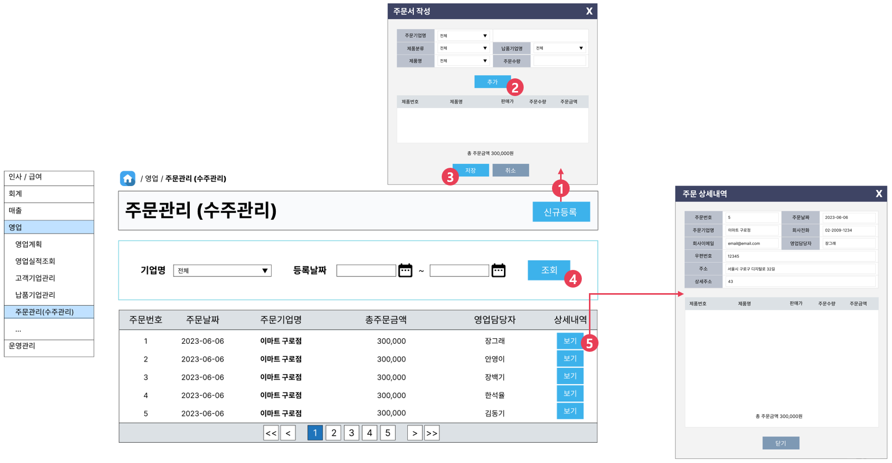

# [⬅️](../README.md) DK-ERP 주문관리 구현

> 개발 담당자 : 이수경
>
> 개발 기간 : 2023-06-15 ~ 2023-06-26
>
> 개발 우선순위 : 2순위
>
> ---
>
> < Contents >
>
> [1. 구현완료 화면](#1-구현완료-화면)
>
> [2. 소스코드](#2-소스코드)
>
> [3. 화면설계](#3-화면설계)
>
> ---

## 1. 구현완료 화면

▲ 전체 주문 목록 조회, 주문 기업명/날짜 검색, 1건 조회 기능 구현

▲ 주문 신규등록 기능 구현

- [추가] 버튼을 클릭할 때마다, 다양한 제품과 수량을 1건의 주문서에 추가할 수 있다.
- [저장] 버튼을 클릭하면, 주문서 정보 뿐만 아니라 회계전표 정보도 함께 저장된다.

## 2. 소스코드

- Java
  - 파일경로 `/src/main/java/kr/happyjob/study/busOdm`
  - [소스코드](../src/main/java/kr/happyjob/study/busOdm)
- SQL
  - 파일경로 `/src/main/resources/sql/BusOdm`
  - [소스코드](../src/main/resources/sql/BusOdm)
- JSP
  - 파일경로 `/src/main/webapp/WEB-INF/view/busOdm`
  - [소스코드](../src/main/webapp/WEB-INF/view/busOdm)

## 3. 화면설계

1️⃣ [신규등록] 버튼을 클릭하면, 신규 주문서를 입력할 수 있는 팝업 창이 열린다.

2️⃣ [추가] 버튼을 클릭할 때마다, 다양한 품목을 주문서에 추가할 수 있다.

3️⃣ [저장] 버튼을 클릭하면, 주문서 정보 뿐만 아니라 회계전표 정보도 함께 저장된다.

4️⃣ 주문기업명, 주문날짜를 기준으로 전체 목록을 검색한다.

5️⃣ 상세내역 [보기] 버튼을 클릭하면, 상세정보를 확인할 수 있는 팝업 창이 열린다.

---

⬆️ [(위로가기)](https://github.com/code-sum/DK-ERP/blob/master/notes/busOdm.md)