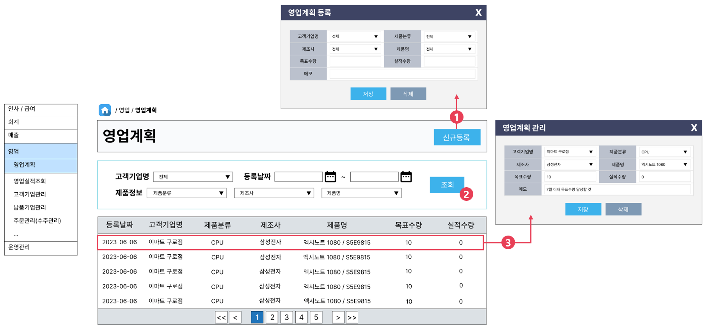

# [⬅️](../README.md) DK-ERP 영업계획 구현

> 개발 담당자 : 이수경
>
> 개발 기간 : 2023-06-27
>
> 개발 우선순위 : 3순위
>
> ---
>
> < Contents >
>
> [1. 구현완료 화면](#1-구현완료-화면)
>
> [2. 소스코드](#2-소스코드)
>
> [3. 화면설계](#3-화면설계)
>
> ---

## 1. 구현완료 화면

▲ 영업계획 목록 조회, 1건 조회 기능 구현

▲ 영업계획 신규등록 및 유효성 검사 기능 구현

▲ 영업계획 삭제 및 검색 기능 구현

## 2. 소스코드

- Java
  - 파일경로 `/src/main/java/kr/happyjob/study/busSap`
  - [소스코드](../src/main/java/kr/happyjob/study/busSap)
- SQL
  - 파일경로 `/src/main/resources/sql/busSap`
  - [소스코드](../src/main/resources/sql/busSap)
- JSP
  - 파일경로 `/src/main/webapp/WEB-INF/view/busSap`
  - [소스코드](../src/main/webapp/WEB-INF/view/busSap)

## 3. 화면설계

1️⃣ [신규등록] 버튼을 누르면, 신규 영업계획을 작성할 수 있는 팝업창이 열린다.

2️⃣ 고객기업명, 계획등록일, 제품정보를 기준으로 본인이 작성한 영업계획 목록을 검색한다.

3️⃣ 조회를 원하는 영역을 클릭하면 상세정보를 확인할 수 있는 팝업창이 열린다.

---

⬆️ [(위로가기)](https://github.com/code-sum/DK-ERP/blob/master/notes/busSap.md)
