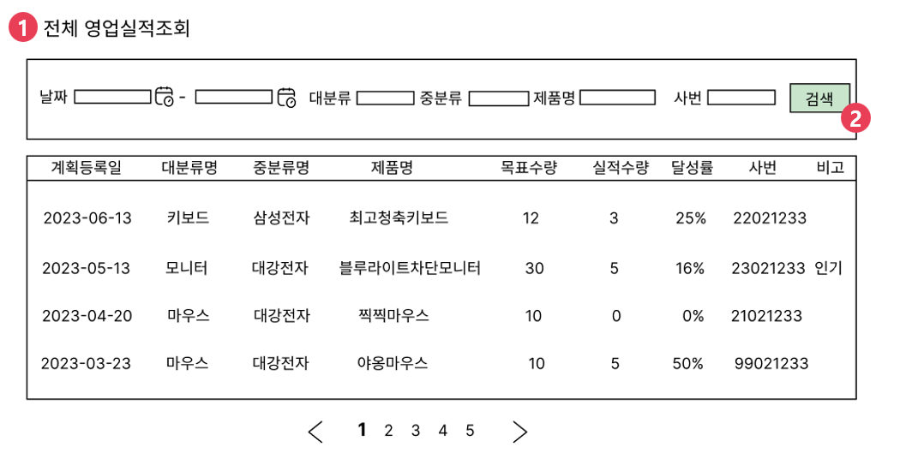
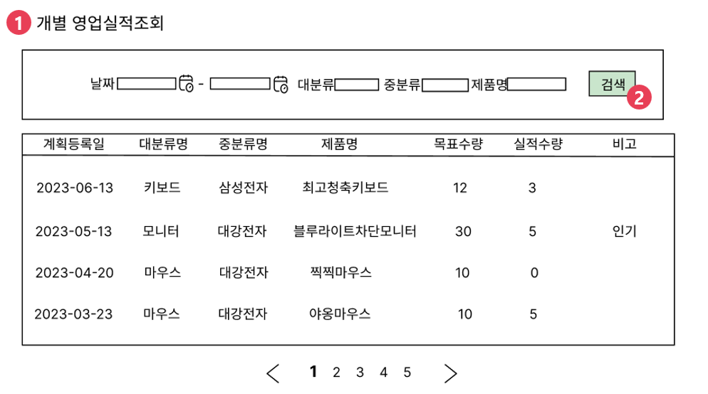

# [⬅️](../README.md) DK-ERP 영업실적조회 구현

> 개발 담당자 : 이수경
>
> 개발 기간 : 2023-06-28
>
> 개발 우선순위 : 4순위
>
> ---
>
> < Contents >
>
> [1. 구현완료 화면](#1-구현완료-화면)
>
> [2. 소스코드](#2-소스코드)
>
> [3. 화면설계](#3-화면설계)
>
> ---

## 1. 구현완료 화면

▲ 임원진 계정(이름:이서연, 사번:202306064) 로그인 시, 영업실적조회

- 요구사항 : 임원진은 영업팀 사원 전체의 실적을 관리해야 함

- 임원진 로그인 시, 영업팀 전체 실적을 조회하는 기능 구현
- 임원진 로그인 시, (영업)담당자사번도 검색 조건에 추가

▲ 영업사원 계정(이름:최은서, 사번:202306068) 로그인 시, 영업실적조회

- 요구사항 : 영업사원은 다른 사람의 실적을 확인할 수 없고, 본인의 실적만 관리해야 함
- 영업사원 로그인 시, 본인의 실적만 조회하는 기능 구현
- 영업사원 로그인 시, (영업)담당자사번 칸이 disabled 처리되어 검색 조건에서 제외되며, 본인의 사번만 출력되므로 변경/조작 불가

## 2. 소스코드

- Java
  - 파일경로 `/src/main/java/kr/happyjob/study/busSas`
  - [소스코드](../src/main/java/kr/happyjob/study/busSas)
- SQL
  - 파일경로 `/src/main/resources/sql/busSas`
  - [소스코드](../src/main/resources/sql/busSas)
- JSP
  - 파일경로 `/src/main/webapp/WEB-INF/view/busSas`
  - [소스코드](../src/main/webapp/WEB-INF/view/busSas)

## 3. 화면설계

▲  임원진 계정 로그인 시, 영업실적조회

1️⃣ 영업팀에 소속된 전체 사원의 실적 목록을 조회할 수 있다.

2️⃣ (영업)담당자사번, 고객기업명, 계획등록일, 제품정보를 기준으로 영업팀 사원들의 실적을 검색한다. 

▲  영업사원 계정 로그인 시, 영업실적조회

1️⃣ 본인의 실적 목록만 조회할 수 있다.

2️⃣ 고객기업명, 계획등록일, 제품정보를 기준으로 본인의 실적을 검색한다. 

---

⬆️ [(위로가기)](https://github.com/code-sum/DK-ERP/blob/master/notes/busSas.md)