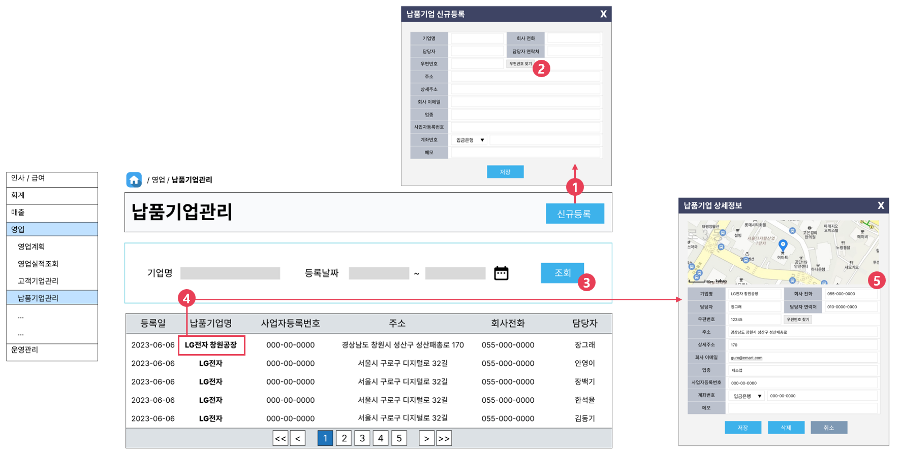

# [⬅️](../README.md) DK-ERP 납품기업관리 구현

> 개발 담당자 : 이수경
>
> 개발 기간 : 2023-06-13
>
> 개발 우선순위 : 0순위
>
> ---
>
> < Contents >
>
> [1. 구현완료 화면](#1-구현완료-화면)
>
> [2. 소스코드](#2-소스코드)
>
> [3. 화면설계](#3-화면설계)
>
> ---

## 1. 구현완료 화면

▲ 납품기업 목록 조회, 기업명/사업자등록번호 검색, 1건 조회 기능 구현

- 1건 조회 시, 기업 주소별 지도와 마커를 화면에 표시 (Kakao Map API 활용)
- [고객기업관리](busClm.md)와 동일한 방식으로 CRUD 기능 구현

## 2. 소스코드

- Java
  - 파일경로 `/src/main/java/kr/happyjob/study/busSpm`
  - [소스코드](../src/main/java/kr/happyjob/study/busSpm)
- SQL
  - 파일경로 `/src/main/resources/sql/BusSpm`
  - [소스코드](../src/main/resources/sql/BusSpm)
- JSP
  - 파일경로 `/src/main/webapp/WEB-INF/view/busSpm`
  - [소스코드](../src/main/webapp/WEB-INF/view/busSpm)

## 3. 화면설계

1️⃣ [신규등록] 버튼을 누르면, 신규 납품기업 정보를 입력할 수 있는 팝업 창이 열린다.

2️⃣ [우편번호 찾기] 버튼을 누르면, Daum 우편번호 서비스 창이 열린다.

3️⃣ 납품기업명, 사업자등록번호를 기준으로 전체 목록을 검색한다.

4️⃣ 납품기업명을 클릭하면, 상세정보를 확인할 수 있는 팝업 창이 열린다.

5️⃣ 기업 상세정보를 확인할 수 있는 모달 창에 카카오맵을 표시한다.

---

⬆️ [(위로가기)](https://github.com/code-sum/DK-ERP/blob/master/notes/busSpm.md)