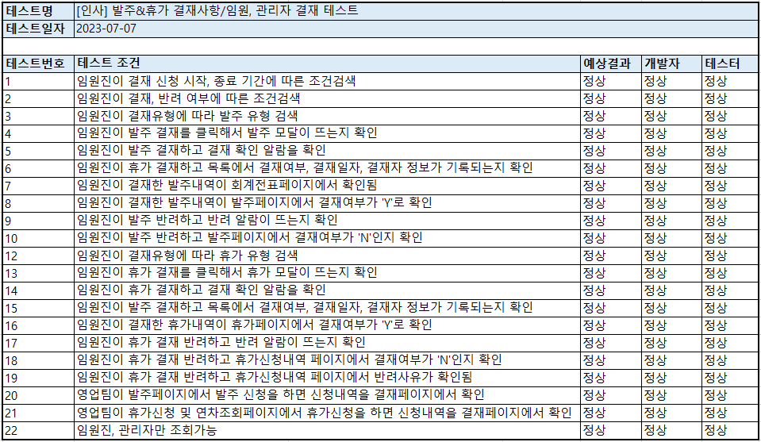

# [⬅️](../README.md) DK-ERP 통합테스트

> 1. 개발 담당자 : 강문주, 박동근, 이선희, **이수경**, 이은지, 조하나
> 1. 통합테스트 기간 : 2023-07-07 ~ 2023-07-11

## 1. [회계] 통합테스트

> <테스트 항목>
>
>   1-1. 계정과목관리
>
>   1-2. 지출결의서 신청
>
>   1-3. 지출결의서 조회 및 승인
>
>   1-4. 회계전표

##### 1-1. 계정과목관리

 

##### 1-2. 지출결의서 신청

 

##### 1-3. 지출결의서 조회 및 승인

 

##### 1-4. 회계전표

 

## 2. [영업] 통합테스트

> <테스트 항목>
> *고객기업관리, 납품기업관리는 테스트 항목에서 제외
>
>   2-1. 영업계획
>
>   2-2. 영업실적조회
>
>   2-3. 주문관리
>
>   2-4. 발주내역조회
>
>   2-5. 제품정보

##### 2-1. 영업계획

 

##### 2-2. 영업실적조회

 

##### 2-3. 주문관리

 

##### 2-4. 발주내역조회

 

##### 2-5. 제품정보

 

## 3. [달력] 통합테스트

> <테스트 항목>
>
> - 월별결재관리

 

## 4. [인사] 통합테스트

> <테스트 항목>
>
> 4-1. 인사관리
>
> 4-2. 마이페이지
>
> 4-3. 휴가신청 및 연차조회
>
> 4-4. 휴가신청내역
>
> 4-5. 급여관리
>
> 4-6. 급여조회
>
> 4-7. 결재관리

##### 4-1. 인사관리

 

##### 4-2. 마이페이지

 

##### 4-3. 휴가신청 및 연차조회

 

##### 4-4. 휴가신청내역

 

##### 4-5. 급여관리

 

##### 4-6. 급여조회

 

##### 4-7. 결재관리

 

## 5. [운영] 통합테스트

> <테스트 항목>
>
>   5-1. 공지사항
>
>   5-2. 공통코드관리

##### 5-1. 공지사항

 

##### 5-2. 공통코드관리

 

## 6. [매출] 통합테스트

> <테스트 항목>
>
> 6-1. 일별매출현황
>
> 6-2. 월별매출현황
>
> 6-3. 연별매출현황

##### 6-1. 일별매출현황

 

##### 6-2. 월별매출현황

 

##### 6-3. 연별매출현황

 

